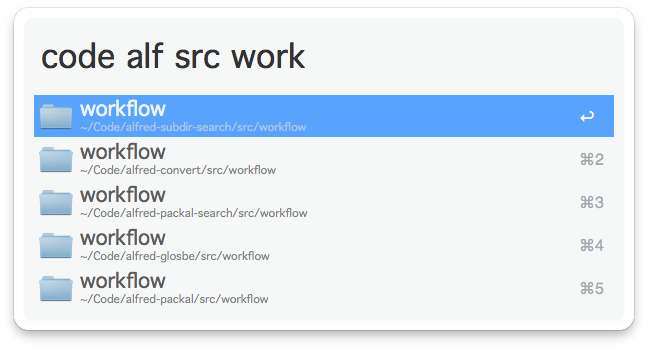
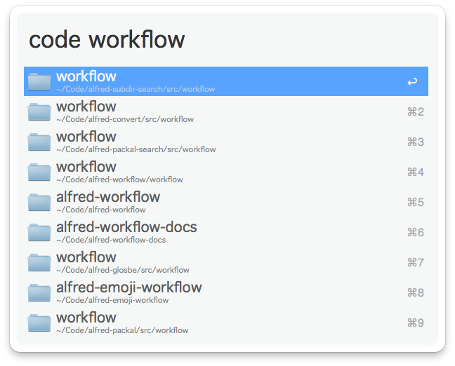
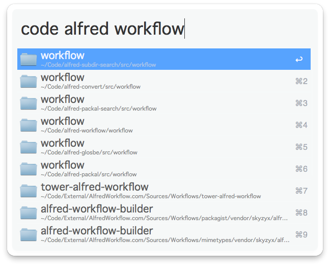
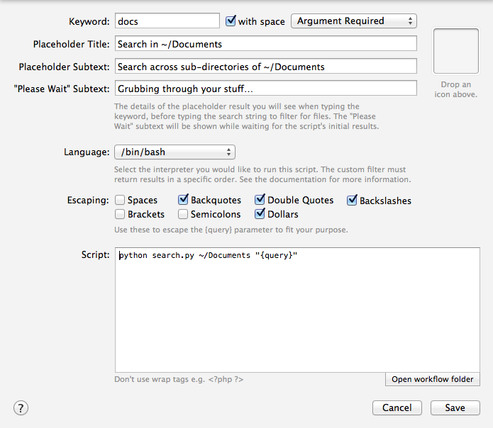

# Subtree Search (Alfred 2 Workflow) #

Drill down across the subtree of the specified root directory.



**Note:** This Workflow requires you to configure your own **Script Filters** in Alfred (by default, there is one configured for **~/Documents** with keyword `docs`). See [Configuration][] for instructions.

## What it does ##

This Workflow provides partial matching of path components, allowing you to drill down into your filesystem with a space-separated query. Each "word" of the query will be matched against the components of a directory or file's path, so a three-word query will only match at least three levels down from the specified root directory.

For example, I have a Script Filter set up to search **~/Code** with keyword `code`:

```bash
python search.py -d ~/Code "{query}"
```

(`-d` tells `search.py` to only search for directories.)

Entering `code workflow` into Alfred produces as list of all subdirectories somewhere under **~/Code** whose names contain `workflow` (the search is case-insensitive):



Entering `code alfred workflow` produces a list of all subdirectories somewhere under **~/Code** whose names contain `workflow`, **which are also somewhere under a directory whose name contains** `alfred`:



## Configuration ##

The Workflow is pre-configured to search **~/Documents** using the keyword `docs`. To search other directories, you'll have to add your own **Script Filter(s)**, adjusting the **Keyword** and root directory in the **Script** field.

The `-d` option tells `search.py` to only return directories.



## Screenshots ##


## Licence ##

This Workflow is released under the [MIT Licence](http://opensource.org/licenses/MIT).
